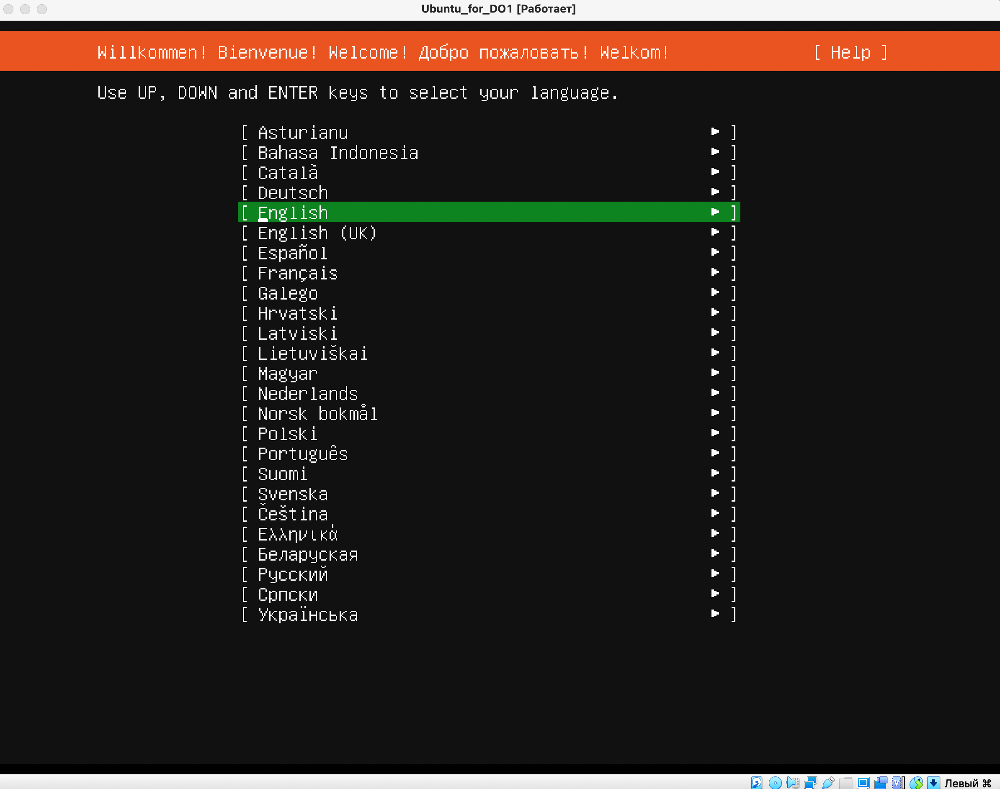
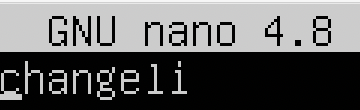
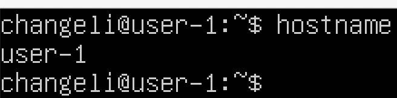
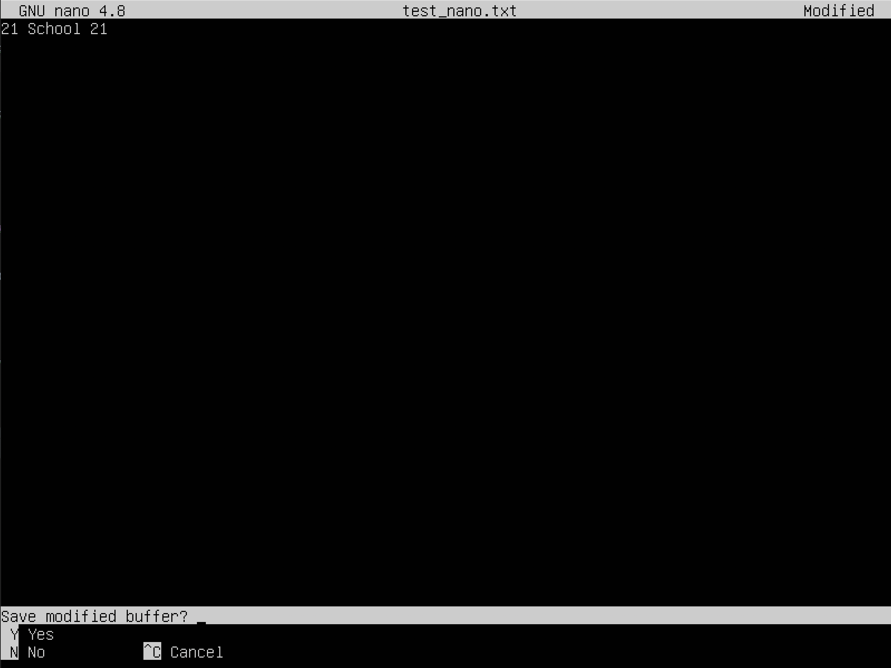
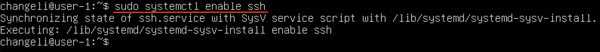
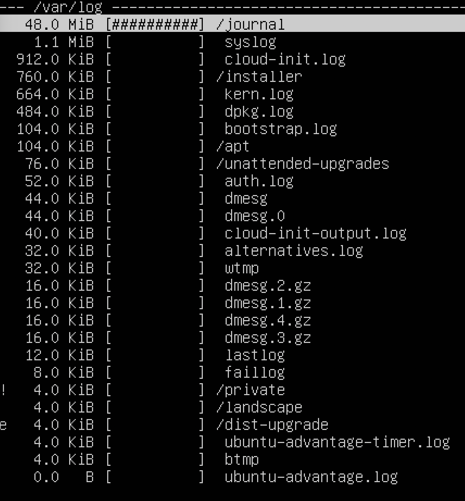

## Part 1. Установка ОС
1. Начало установки Ubuntu 20.04

2. Продолжение установки Ubuntu 20.04

3. Определение версии установленной ОС

## Part 2. Создание пользователя

1. Создание нового пользователя и добавление его в группу adm
   - G - Список дополнительных групп, в которых числится пользователь. Перечисление групп осуществляется 
   через запятую, без промежуточных пробелов. На указанные группы действуют те же ограничения, что и для группы указанной 
   в параметре -g. По умолчанию пользователь входит только в начальную группу.
   - m - Если домашнего каталога пользователя не существует, то он будет создан.
   - s - Имя регистрационной оболочки пользователя. Если задать пустое значение, то будет использована регистрационная оболочка по умолчанию.
   

2. Вывод команды cat /etc/passwd с подтверждением создания нового пользователя

3. Вывод команды vi /etc/group с подтверждением внесения пользователя в группу adm

## Part 3. Настройка сети ОС

1. Вызов команды sudo nano /etc/hostname для смены названия машины

2. Замена старого названия                  

3. На новое                                 

4. Проверка название машины после перезагрузки

5. Установка временной зоны при помощи команды dpkg-reconfigure tzdata.
 
##### Вывести названия сетевых интерфейсов с помощью консольной команды.
6. Вывод названий сетевых интерфейсов при помощи команды ip addr show    
lo (local loopback) используется для того, чтобы компьютер мог обращаться к самому себе и имеет по умолчанию ip-адрес 127.0.0.1 на всех компьютерах.

 
7. Получение ip-адреса устройства от DHCP сервера   
   DHCP - Dynamic Host Configuration Protocol - протокол, использующийся для автоматического выставления различной конфигурации, в том числе IP-адресов.

8. Внешний ip-адрес шлюза

9. Установка статичных настроек ip, gw, dns

10. После перезагрузки виртуальной машины, настройки не изменились. 
Пингование удаленных хостов 1.1.1.1 и ya.ru прошло успешно.

## Part 4. Обновление ОС

Команда apt update обновляет индекс пакетов в системе Linux или списки пакетов.   
Команда apt upgrade обновляет пакеты программного обеспечения до последних версий
1. Обновление индексов при помощи команды sudo apt update

2. После обновления системных пакетов при помощи команды sudo apt upgrade, проводим проверку на необходимость обновления

## Part 5. Использование команды **sudo**

Команда sudo ( substitute user and do, подменить пользователя и выполнить ) позволяет строго определенным пользователям выполнять указанные программы с административными привилегиями без ввода пароля суперпользователя root.
1. Смена hostname от имени пользователя, созданного в пункте Part2.        

## Part 6. Установка и настройка службы времени

1. Вывод команды timedatectl show, показывающая время часового пояса.

## Part 7. Установка и использование текстовых редакторов 

1. VIM
- :wq - выход из VIM с сохранением

- :q! - выход из VIM без сохранения

- /School - поиск слова

- :s/School/biba and boba - замена слова на другое

2. NANO
- Control + X -> Y -> Enter - последовательность для выхода с сохранением

- Control + X -> N - последовательность для выхода без сохранения

- Control + W - поиск слова

- Control + \ -> ввод слова для поиска -> Enter -> ввода слова для замены -> Enter -> Y -> Enter

3. JOE
sudo apt install joe
- Control + K -> Q -> Y - последовательность для выхода с сохранением

- Control + K -> Q -> N - последовательность для выхода без сохранения

- Control + K -> F + r -> new -> Y - последовательность для выхода без сохранения

## Part 8. Установка и базовая настройка сервиса **SSHD**
1. Установка службы SShd при помощи команды sudo apt-get install ssh

2. Включение автостарта службы при загрузке системы при помощи команды sudo systemctl enable ssh

3. sudo vim /etc/ssh/sshd_config - замена порта 22 на 2022

4. ps - выводит список текущих процессов на сервере.
    Флаги:                
   -A, -e, (a) - выбрать все процессы;      
   -a - выбрать все процессы, кроме фоновых;   
   -d, (g) - выбрать все процессы, даже фоновые, кроме процессов сессий;   
   -N - выбрать все процессы кроме указанных;         
   -С - выбирать процессы по имени команды;        
   -G - выбрать процессы по ID группы;        
   -p, (p) - выбрать процессы PID;         
   --ppid - выбрать процессы по PID родительского процесса;       
   -s - выбрать процессы по ID сессии;          
   -t, (t) - выбрать процессы по tty;       
   -u, (U) - выбрать процессы пользователя.       

Наличие процесса sshd.

5. Вызов команды netstat -tan

   -a - Отображение всех подключений и ожидающих портов      
   -n - Отображение адресов и номеров портов в числовом формате       
   -t - Отображение текущего подключения в состоянии переноса нагрузки с процессора на сетевой адаптер при передаче данных ( "offload" )  
   0.0.0.0 означает, что подключение может быть выполнено с/на любой адрес   
   LISTEN - готовность к установке соединения

## Part 9. Установка и использование утилит **top**, **htop**

1. Вызов команды top

Сортировка по %MEM

Сортировка по %CPU

   - uptime = 8 min
   - user - 1
   - общая загрузка системы - 0, 0, 0
   - общее количество процессов - 109
   - загрузка cpu - 0
   - загрузка памяти - 169.8
   - pid память - 1378
   - pid cpu - 1563

2. Вызов команды htop
 - Сортировка по PID

 - Сортировка по PERCENT_CPU

 - Сортировка по PERCENT_MEM

 - Сортировка по TIME

 - Фильтр по процессу sshd

 - Процесс syslog

 - hostname, clock, uptaime

## Part 10. Использование утилиты **fdisk**
1. Запуск команды fdisk -l
   - Название жесткого диска - /dev/sda
   - Размер жесткого диска - 20 GiB
   - Количество секторов - 41943040

2. Размер swap

## Part 11. Использование утилиты **df** 
1. Запуск команды df
    - Размер раздела - 10218772
    - Размер занятого пространства - 4600004
    - Размер свободного пространства - 5078096
    - Процент использования - 48%
    - Единица измерения - Кб

2. Запуск команды df -Th
   - Размер раздела - 9.8 Гб
   - Размер занятого пространства - 4.4 Гб
   - Размер свободного пространства - 4.9 Гб
   - Процент использования - 48%
   - Единица измерения - Гб

## Part 12. Использование утилиты **du**

1. Вывод команды du       

2. Вывод размера папок /home, /var, /var/log

3. Вывод размеров всего содержимого в /var/log

## Part 13. Установка и использование утилиты **ncdu**

Установка ncdu при помощи команды sudo apt install ncdu
1. Вызов команды ncdu

2. Размер папки /home

3. Размер папки /var

4. Размер папки /var/log

## Part 14. Работа с системными журналами

1. Просмотр /var/log/dmesg

2. Просмотр /var/log/syslog

3. Просмотр /var/log/auth.log

4. Время последней успешной авторизации, имя пользователя и метод входа в систему.

5. Перезапуск системы SSHd

## Part 15. Использование планировщика заданий **CRON**

1. Установка задачи uptime

